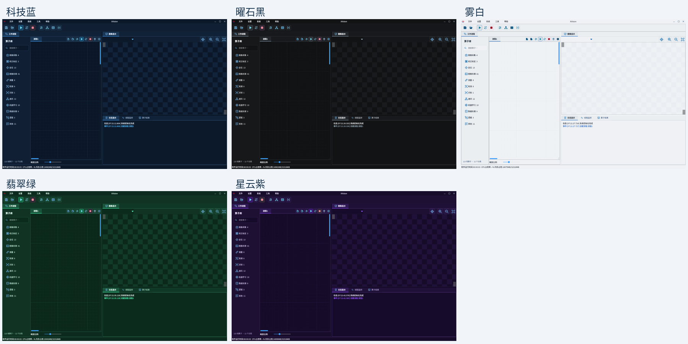
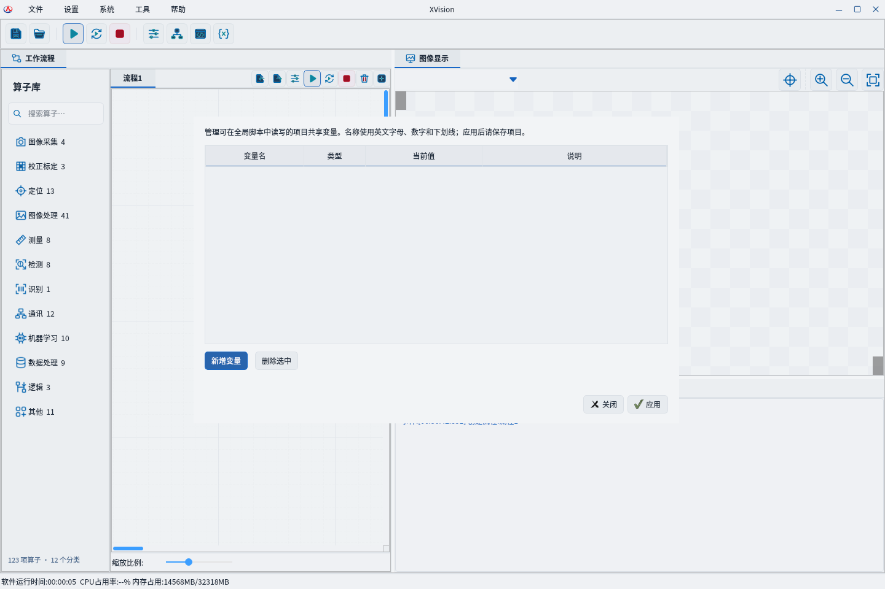
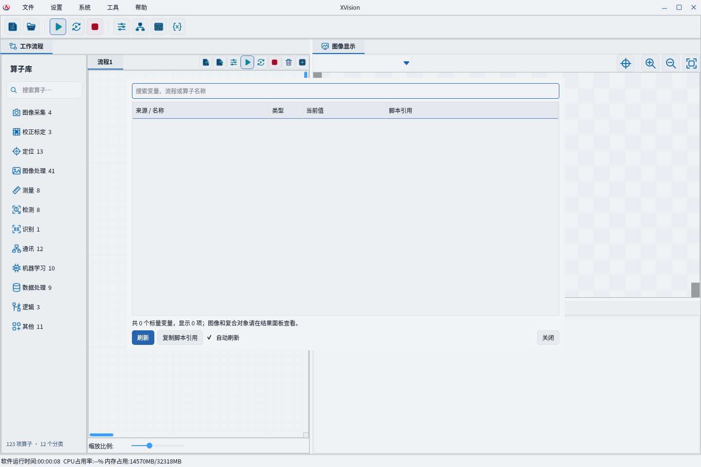
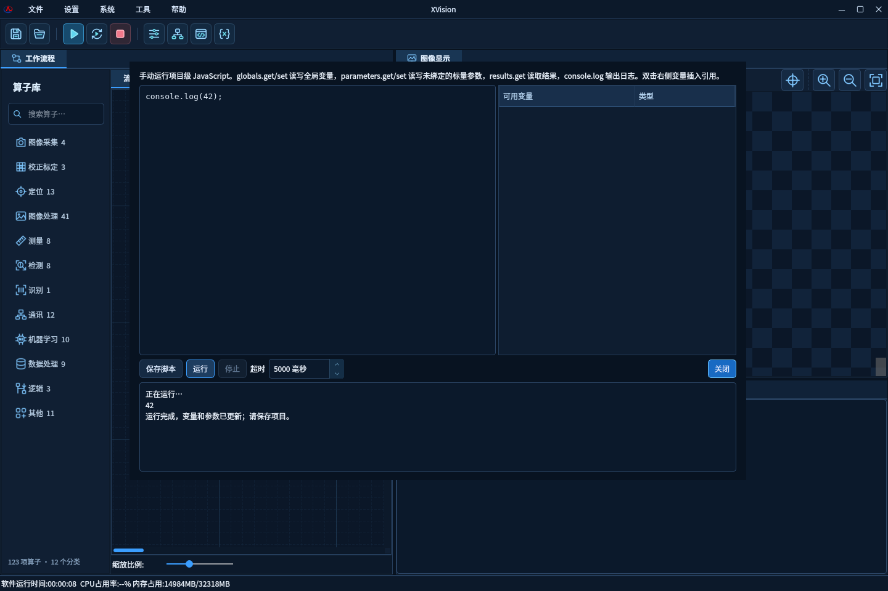
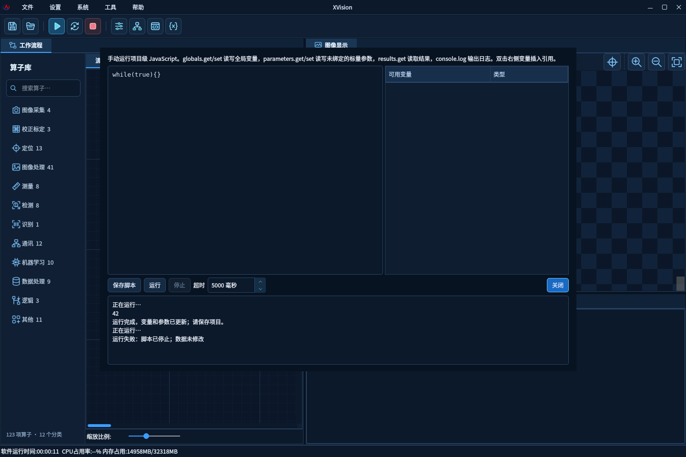
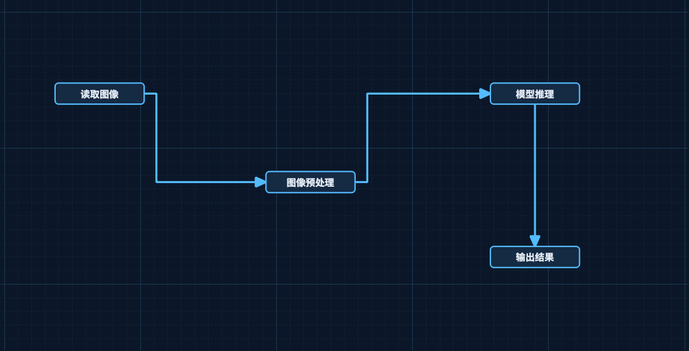
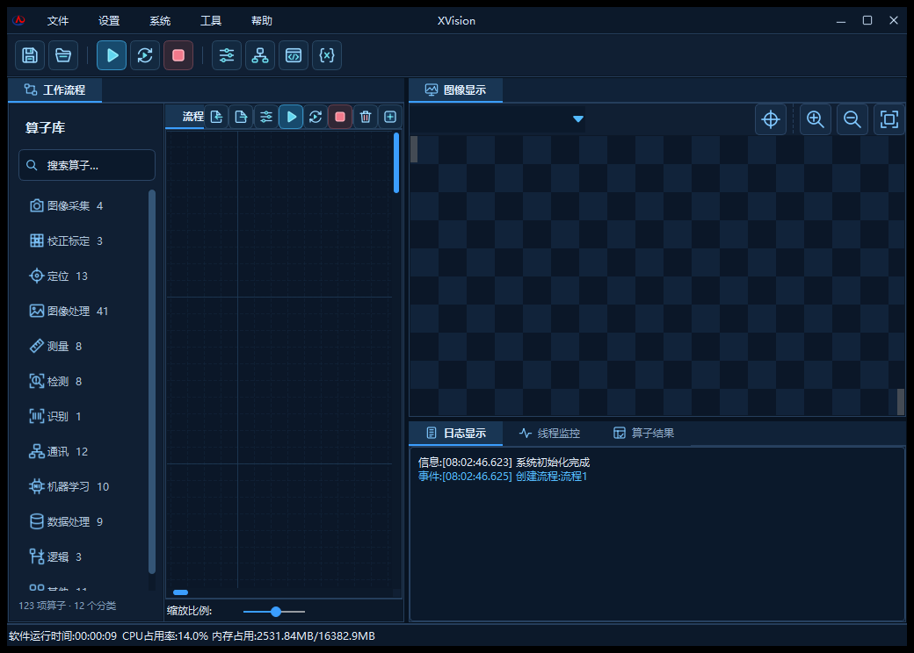

# 流程折线、多主题与全局工具

日期：2026-09-29。

## 功能

- 流程连接采用正交折线，拖动预览、箭头、文本、命中区域和边界共用同一路径。绕开起点和终点节点，不承诺避开画布中所有第三方节点。修复位置通知提前发出导致连线滞后的问题。
- 科技蓝、曜石黑、雾白、翡翠绿、星云紫五种主题。在“设置 → 系统设置”或“系统 → 外观主题”切换，即时生效并记住选择。覆盖停靠栏、流程画布/节点/连线、图像背景、自绘下拉框、日志和图标。
- 顶部提示缩小为 11px 字号和 3px/6px 内边距。
- Windows 主程序使用 GUI 子系统；控制台测试工具保留输出。
- 全局管理：增删编辑整数、实数、布尔、字符串变量，随项目保存；校验重名、类型、大小和 XML 可保存性。
- 变量管理：搜索和查看全局变量、算子标量参数/结果，支持刷新及复制脚本引用。运行期间暂停读取；图像和复合对象仍在结果面板查看。
- 全局脚本：采用用户选择的内置 JavaScript，提供编辑、保存、运行、停止、超时及日志。

## 脚本使用

不需要安装 Node.js、Python 或 .NET。QtQml 运行库随软件打包。
先创建整数全局变量 count，应用后运行：

~~~javascript
const next = globals.get("count") + 1;
globals.set("count", next);
console.log("当前计数", next);
~~~

右侧变量列表双击插入引用。parameters.get(key) 读取参数，parameters.set(key, value) 修改未订阅的标量参数，results.get(key) 只读检测结果。key 使用“流程ID/算子ID/参数名”。

脚本由按钮手动执行，不自动插入流程调度。成功后先检查项目空闲、快照未变化、类型及全部参数合法，再统一提交。错误、超时、取消、项目变化或订阅参数写入不会应用部分数据。

默认超时 5 秒，允许 100–30000 毫秒。独立脚本进程可被强制停止。Windows Job Object 限制进程内存 512MiB，Linux 开发验证限制地址空间 1GiB。此机制用于错误脚本隔离，不声明为恶意代码安全沙箱。日志最多 100 条，每条 1024 字符。

XML v1 增加可选 Globals 节点；旧项目缺省为空，新项目严格校验。应用变量或保存脚本后，仍需“保存项目”写入文件。

## 验证

Linux Qt 5.12.8 完整构建通过；19 组 CTest 通过。新增测试覆盖脚本执行/错误/超时/停止/恢复、原子提交、过期快照、绑定参数拒绝、项目销毁、XML 往返及旧项目、运行锁、真实编辑窗口、主题记忆与图元更新、折线和端口移动。
PowerShell 打包契约检查 55 项及模拟流程场景 15 项通过，包括 QtQml 缺失拒绝。
Windows Qt 6.4.0 Release 原生构建及 19 组 CTest 全部通过。QtTest 共 285 项通过、0 项失败、7 项条件跳过；新增 global_tools 的 19 项全部通过。跳过项为 5 个后端关闭分支（本包已启用后端）及 2 个未配置外部二维码/级联模型资源的用例。

解压后仅使用随包文件与 Windows 系统目录启动成功；PE 子系统为 GUI（2），JavaScript worker 读写和日志验证通过。QtQml、OpenCV、CPU ONNX Runtime 和 MSVC 运行库齐全；无 HALCON DLL 或导入。清单中 70 个文件的 SHA-256 全部一致。

VisionMaster 官方站点本次返回 HTTP 403，搜索服务返回 503。功能依据现有顶部功能名称和项目数据模型实现，未声称与商业软件全部接口或 C# 脚本兼容。

## 界面记录

以下主题与工具截图来自 Linux Qt 5 实际界面；文末附本次 Windows 原生程序包的启动截图。

以下布局用于展示真实流程图组件的连线与主题效果；图中文字为示意节点，不表示执行了相应算子。

## 程序包与提交

- 程序构建提交：e721e579d95e9f88d6ace922b351d51f961e3296。
- Windows Actions：36538872138；原生构件：11020016466。
- 程序包：XVision-Themes-e721e57-win64.zip（Windows x64，Release）。
- ZIP SHA-256：031e0f4401c1e828143af95f363e05fd41e209027bd94586f2c320c37f53a51b。
- 下载后完整解压，运行目录中的 XVision.exe，并保留同目录运行库。应用全局变量或保存脚本后，使用“保存项目”写入项目文件。
- 完整测试与包记录：[测试报告](windows-native-tests.json)、[程序包校验](windows-package-validation.json)。

最初 Windows Qt 6 构建暴露了 QColor::getHslF 指针类型差异，已改为跨版本标量接口。验收时还发现 Windows 预设漏选新增测试，已补齐 Debug/Release 的构建目标与测试筛选，并改为检查实际预设清单，最终原生回归包含 global_tools。

