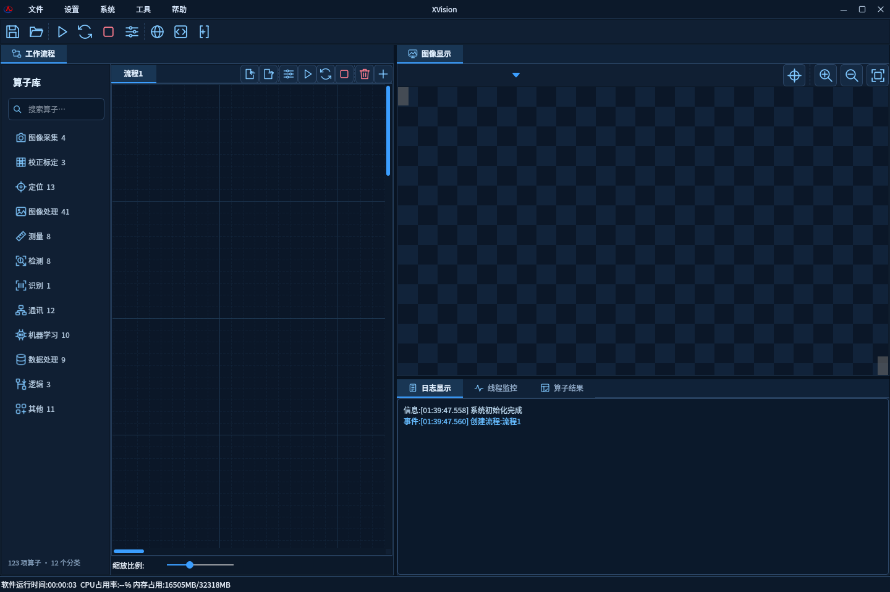
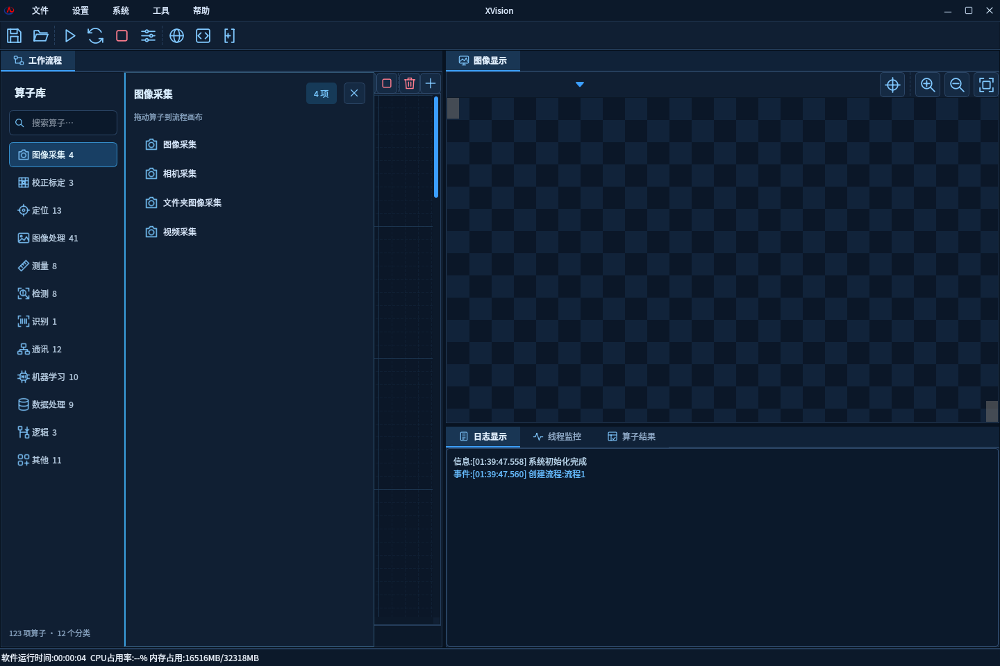
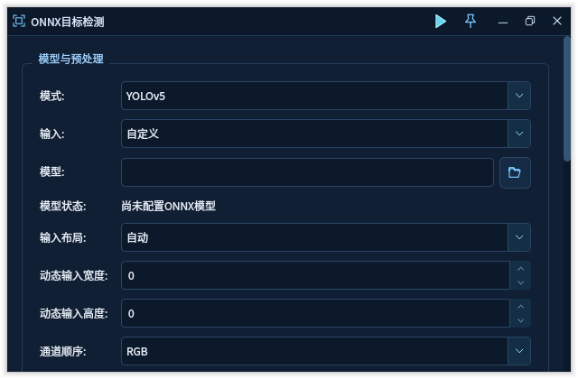
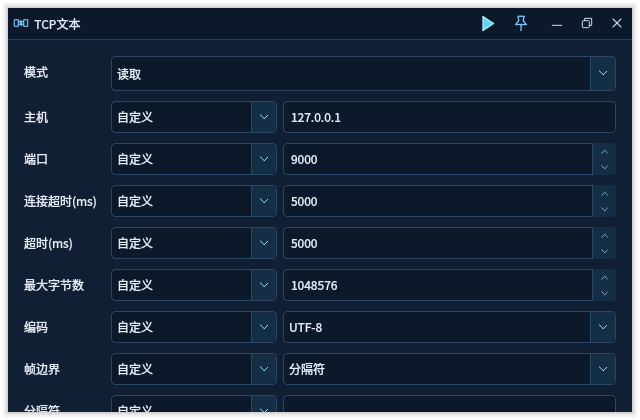

# 算子精简与界面重构

更新日期：2026-09-29。

## 目录与侧边栏

| 项目 | 调整前 | 调整后 |
| --- | ---: | ---: |
| 基础实现 | 39 | 39 |
| 非基础入口 | 126 个兼容预设 | 84 个独立配置预设 |
| 展示入口 | 165 | 123 |
| 重复配置入口 | 42 | 0 |
| 旧兼容 ID 注册 | 126 | 0 |

删除 42 个重复入口，入口数量减少 25.5%。保留所有独立初始配置；39 个基础实现继续共用算法后端。默认模式直接使用规范角色，非默认模式采用 Role.EnumKey，例如 ImageAcquisition.Camera、TcpText.Write、NObjectDetection.Yolov5。未保留旧兼容 ID、隐藏别名或名称回退。

新的唯一目录为 [算子目录.csv](../算子目录.csv)。旧盘点报告和 VisionMaster 矩阵仅保留为历史资料，不参与当前注册、测试和打包。按规范角色及参数保存的工程仍支持往返；直接引用已删除 ID 的外部调用或手工工程不再接受。

侧栏只显示非空分类，提供中文名称、数量和防抖全局搜索。分类共用一个延迟创建的列表面板，替代逐算子控件和重复抽屉；按 Escape 或点击外部关闭。拖动使用新的入口 ID，拖动结束后释放临时对象。

| 当前分类 | 入口数 |
| --- | ---: |
| 图像采集 | 4 |
| 校正标定 | 3 |
| 定位 | 13 |
| 图像处理 | 41 |
| 测量 | 8 |
| 检测 | 8 |
| 识别 | 1 |
| 通讯 | 12 |
| 机器学习 | 10 |
| 数据处理 | 9 |
| 逻辑 | 3 |
| 其他 | 11 |

## 稳定性与布局

复现并修复通讯参数切换崩溃：旧代码在组合框信号回调内直接删除当前组合框，导致 SIGSEGV。现在由公共基类投递一次合并的延后重建，退出信号处理后再更新表单。算子和订阅源使用 QPointer，销毁后停止使用；外部父容器中的算子面板跟随侧栏释放。

参数页统一由公共滚动容器承载，支持窗口缩放、长标签换行和长表单滚动，输入项维持可读高度。移除固定窗口尺寸和重建后的强制尺寸调整；ONNX 页按模型与预处理、分类、检测、分割分组。首开窗口受当前屏幕可用区域约束。

本次沿用上一轮 CPU 后端、托管单算子执行与日志批处理边界，没有宣称本轮进一步加速 ONNX 模型计算；本轮改进重点是界面对象数量、事件生命周期和参数页响应。

## 科技蓝界面

39 个规范算子各使用独立的蓝色 SVG 图标。侧栏、行列表、工具按钮、运行/置顶/打开/保存/刷新图标和输入框箭头统一风格。参数页保留中文说明及必要的算法专有名词。

## 验证记录

- 修改前回归真实重现固定尺寸、缺少公共滚动区和参数切换 SIGSEGV。
- systemplugin 实例化 39 个角色、84 个预设；规范化完整持久化配置后确认 123 项互不重复，并拒绝全部 126 个旧 ID。
- UI 回归覆盖全部 123 个入口（ElapsedTimer 无独立参数窗口）、字段高度、滚动可达、640×420 布局、面板显示、搜索、复用和释放。
- Linux Qt 5.12.8、ONNX Runtime 1.18.1：完整 CTest 18/18 通过；UI 套件 136 项通过；150% 和 200% 缩放参数页检查各 125 项通过。
- 10000 条 GUI 日志入队 3 ms、后台日志排空 0 ms、单算子按钮返回 0 ms，均为一次合成测试的毫秒计时结果，不代表真实模型吞吐率或所有机器表现。
- Windows 打包脚本契约 49 项通过，模拟打包流程 14 项通过（含新目录路径、文件头及 123 行数据校验）。模拟打包不代替原生运行验收。

Linux 本地构建未启用 OpenCV C++ SDK，对应算法执行用例有跳过；窗口和注册检查均执行。原生 Windows 构建结果、提交和便携包信息在完成后补充。
