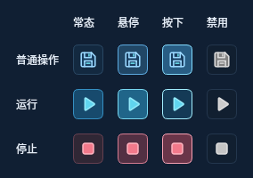
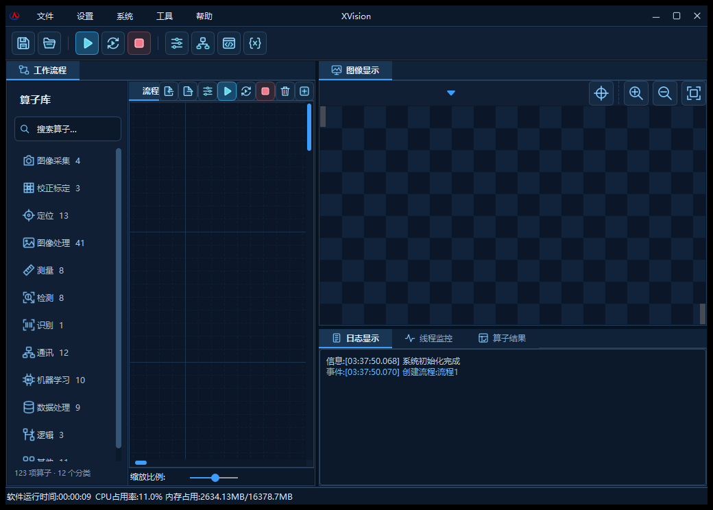

# 顶部工具栏优化

日期：2026-09-29

源码提交：7f2fc4268e26fd36e33c827d4b7319b8466e6a09

## 界面调整
- 重绘 22 个顶部、流程及关联菜单 SVG 图标，统一 24×24 画布、圆角线条和蓝青配色。
- 主工具栏按文件、运行、管理分组；运行突出为蓝色，停止使用柔和红色标识。
- 主按钮 34×34 / 图标 22×22；流程按钮 28×28 / 图标 18×18。
- 采用标准 Qt 按钮，统一悬停、按下、键盘焦点和禁用状态，补齐中文无障碍名称。
- 保留原有 17 个按钮的对象名称和动作连接。

## 验证
- Linux Release 主程序和界面测试目标编译通过。
- 外观、界面响应性 CTest 2/2 通过。
- 22 个 SVG 文件和嵌入资源路径检查通过。
- 已核对实际窗口在 1440×960 和 1040×750 下的布局。
- 修复 Qt 5 在 150%/200% 缩放时的图标像素化，实际截图验证清晰度恢复。
- 原有工作区暂存内容未变动，本次提交独立位于 build/windows-exe 发布分支。

Windows 原生构建 36517009532 已通过，15 组 Qt 测试：266 通过、0 失败、7 跳过。跳过项为 5 个不适用于已启用后端的分支与 2 个未提供的外部样本。

原生打包及解压后启动检查通过；下载产物与精确提交一致，全部 69 项清单文件 SHA256 验证通过。

## 高清修正
Qt 5 专用启动修正提交：e84c0a8fd4484b04b5dca7dc6679fb364709205f。该代码由 Qt < 6 条件编译保护，不改变 Windows Qt 6 的程序行为。

## 程序包
- ZIP：XVision-TechBlue-7f2fc42-win64.zip
- EXE：XVision/dist/XVision-TechBlue-7f2fc42-win64/XVision.exe
- ZIP 大小：89929288 字节
- ZIP SHA256：f8913632775eaff889d74f817e3559ef9dc1b7e6ce2aa33ee098b17799230b23
- 使用方式：解压整个目录后启动 XVision.exe，保留同目录运行库。
